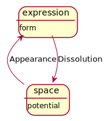
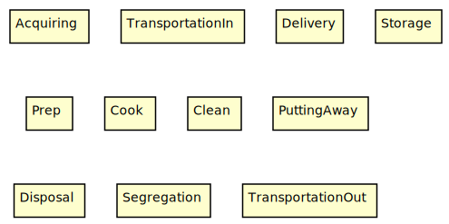
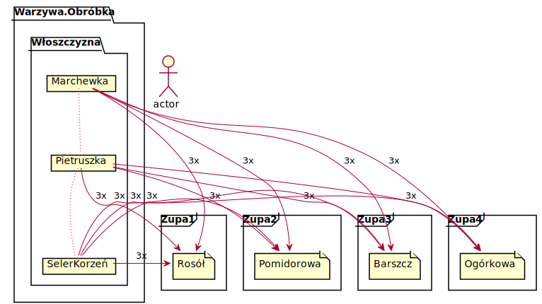

Haha! Welcome to Kitchen Flows!😍
The magical land of hope and wonders *(Charlie🦄)*! 

# Plantuml setup mac
Brace up charlie! 
VsCode:
- PlantUml
- Markdown Preview Enhanced (plantuml rendering in md)
- Vscode-reveal (for themes, quick export and rendering plantuml in md)

Monterey:
- Get Oracle java: remove old, reinstall new

      sudo rm -fr /Library/Internet\ Plug-Ins/JavaAppletPlugin.plugin
      sudo rm -fr /Library/PreferencePanes/JavaControlPanel.prefPane
      sudo rm -fr ~/Library/Application\ Support/Oracle/Java
      sudo rm -rf /Library/Java/JavaVirtualMachines

- Get Dot: brew upgrade; brew install graphviz

      brew install libtool
      brew link libtool
      brew install graphviz
      brew link --overwrite graphviz


# Kitchen

## Flows
Basic Kitchen Flows
 - Appearance
 - Expression
 - Dissolving

<div hidden> 

```
@startuml BasicFlows
state space
space : potential
state expression
expression : form
space -up-> expression : Appearance
expression --> space : Dissolution

		
@enduml
```
</div>



## Zones
The usual kitchen has a few zones:
 - Storage Zone (dry and refrigerated)
 - Prep Zone
 - Cook Zone
 - Clean-up Zone
 - Putting Away Zone
 - Disposal Zone
 - Segregation Zone

<div hidden> 

```
@startuml ZonesDiagram
rectangle Acquiring
rectangle TransportationIn
rectangle Delivery
rectangle Storage
rectangle Prep
rectangle Cook
rectangle Clean
rectangle PuttingAway
rectangle Disposal
rectangle Segregation
rectangle TransportationOut
@enduml
```
</div>



# Recipes


<div hidden> 

```
@startuml Recipes1
actor actor
folder Warzywa.Obróbka {
  folder Włoszczyzna {
   card Marchewka
   card Pietruszka
   card SelerKorzeń
  }
}
frame Zupa1 {
file Rosół
}
frame Zupa2 {
file Pomidorowa
}
frame Zupa3 {
file Barszcz
}
frame Zupa4 {
file Ogórkowa
}

Marchewka     -[dotted]do- Pietruszka
Pietruszka    -[dotted]do- SelerKorzeń
Marchewka     -ri-> Rosół : 3x
Pietruszka    -ri-> Rosół : 3x
SelerKorzeń   -ri-> Rosół : 3x

Marchewka     -ri-> Pomidorowa : 3x
Pietruszka    -ri-> Pomidorowa : 3x
SelerKorzeń   -ri-> Pomidorowa : 3x

Marchewka     -ri-> Barszcz : 3x
Pietruszka    -ri-> Barszcz : 3x
SelerKorzeń   -ri-> Barszcz : 3x

Marchewka     -ri-> Ogórkowa : 3x
Pietruszka    -ri-> Ogórkowa : 3x
SelerKorzeń   -ri-> Ogórkowa : 3x
@enduml
```
</div>


