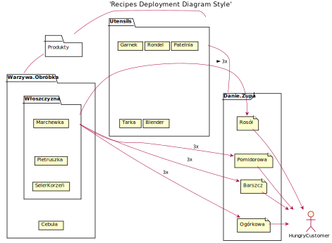
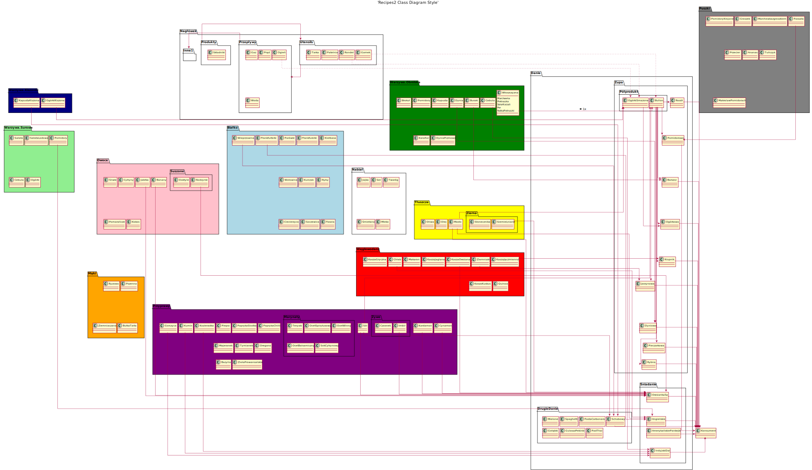

Haha! Welcome to Kitchen Flows!😍
The magical land of hope and wonders *(Charlie🦄)*! 

# Plantuml setup mac
Brace up charlie! 
VsCode:
- PlantUml
- Markdown Preview Enhanced (plantuml rendering in md)
- Vscode-reveal (for themes, quick export and rendering plantuml in md)

Monterey:
- Get Oracle java: remove old, reinstall new

      sudo rm -fr /Library/Internet\ Plug-Ins/JavaAppletPlugin.plugin
      sudo rm -fr /Library/PreferencePanes/JavaControlPanel.prefPane
      sudo rm -fr ~/Library/Application\ Support/Oracle/Java
      sudo rm -rf /Library/Java/JavaVirtualMachines

- Get Dot: brew upgrade; brew install graphviz

      brew install libtool
      brew link libtool
      brew install graphviz
      brew link --overwrite graphviz


# Kitchen

## Flows
Basic Kitchen Flows
 - Appearance
 - Expression
 - Dissolving

<div hidden> 

```
@startuml BasicFlows
state space
space : potential
state expression
expression : form
space -up-> expression : Appearance
expression --> space : Dissolution

		
@enduml
```
</div>


## Zones
The usual kitchen has a few zones:
 - Storage Zone (dry and refrigerated)
 - Prep Zone
 - Cook Zone
 - Clean-up Zone
 - Putting Away Zone
 - Disposal Zone
 - Segregation Zone

<div hidden> 

```
@startuml ZonesDiagram
rectangle Acquiring
rectangle TransportationIn
rectangle Delivery
rectangle Storage
rectangle Prep
rectangle Cook
rectangle Clean
rectangle PuttingAway
rectangle Disposal
rectangle Segregation
rectangle TransportationOut
@enduml
```
</div>


# Recipes

## Deployment diagram
<div hidden> 

```
@startuml Recipes1_Deployment

Title 'Recipes Deployment Diagram Style'
'left to right direction
'top to bottom direction
scale 0.5
skinparam nodesep 5
skinparam ranksep 5
skinparam margin 1
skinparam padding 1
'skinparam linetype ortho

actor HungryCustomer
folder Produkty {
}
folder Utensils {
  card Garnek
  card Rondel
  card Patelnia
  card Tarka
  card Blender
}
folder Warzywa.Obróbka {
  folder Włoszczyzna {
    card Marchewka
    card Pietruszka
    card SelerKorzeń
    Marchewka     -[hidden]d- Pietruszka
    Pietruszka    -[hidden]d- SelerKorzeń
  }
  card Cebula
  SelerKorzeń -[hidden]d-> Cebula
}

frame Danie.Zupa {
 file Rosół
 file Pomidorowa
 file Barszcz
 file Ogórkowa
 Rosół      -[hidden]d- Pomidorowa
 Pomidorowa -[hidden]d- Barszcz
 Barszcz    -[hidden]d- Ogórkowa
}

Produkty -r- Utensils
Produkty -d- Warzywa.Obróbka
Utensils -d- Danie.Zupa

'Warzywa.Obróbka -right-> Danie.Zupa

Włoszczyzna   -r-> Rosół : 3x >
Włoszczyzna   -r-> Pomidorowa : 3x
Włoszczyzna   -r-> Barszcz : 3x
Włoszczyzna   -r-> Ogórkowa : 3x

Rosół -r-> HungryCustomer
Pomidorowa -r-> HungryCustomer
Barszcz -r-> HungryCustomer
Ogórkowa -r-> HungryCustomer
@enduml
```
</div>




## Class diagram
<div hidden> 

```
@startuml Recipes2_Class

Title 'Recipes2 Class Diagram Style'
'left to right direction
'top to bottom direction
scale 0.5
skinparam nodesep 5
skinparam ranksep 5
skinparam margin 1
skinparam padding 1
skinparam linetype ortho

namespace Nagłówek {
  namespace Produkty {
    class Składniki
  }
  namespace Utensils {
    class Garnek
    class Rondel
    class Patelnia
    class Tarka
    class Blender
  }
  namespace Przepływy {
    class Gaz
    class Prąd
    class Woda
    class Ogień
  }
  namespace Przechowywanie {
    class Pojemniki
    class Termos
  }
  namespace Rozpad {
    class Workinaśmieci
    class Sóldozmywarki
    'class Nabłyszczacz
  }
  Nagłówek.Produkty -r-> Nagłówek.Utensils
  Nagłówek.Utensils -r-> Nagłówek.Przepływy
  Nagłówek.Przepływy -r-> Nagłówek.Przechowywanie
  Nagłówek.Przechowywanie -r-> Nagłówek.Rozpad
}

namespace Puszki #grey {
  class MleczkoKokosowe
  class Groszek
  class Kukurydza
  class Marchewkazgroszkiem
  class PomidoryKrojone
  class Passata
  class Przecier
  class Ananas
  class Tuńczyk
  class MakrelawPomidorach
}

namespace Warzywa.Obróbka #green {
  namespace Mrożonki {
    class Trio
    class Pięć
  }
  class Włoszczyzna
    Włoszczyzna : Marchewka
    Włoszczyzna : Pietruszka
    Włoszczyzna : SelerKorzeń
    Włoszczyzna : Por
    Włoszczyzna : NatkaPietruszki
  
  class Cebula
  class Buraki
  class Pomidory
  class Kapusta
  class Brokuł
  class Kalafior
  class Dynia
  class DyniaPizmowa
}
namespace Przetwory #darkcyan {
  namespace Fermentat {
    class Browar
    class Wino
    class Bimber
  }
  namespace Kiszone {
    class OgórkiKiszone
    class KapustaKiszona
    class CukiniaKiszona
  }
  namespace Dżem {
    class Wiśniowy
  }
  namespace Kompot {
    class Jabłkowy
  }
}

namespace Warzywa.Surowe #lightgreen {
  class Sałata
  class SałataLodowa
  class Pomidory
  class Cebula
  class Ogórki
}

namespace Tłuszcze #yellow {
 class Olej
 class Oliwa
 class Masło
 namespace Ziarna {
   class Słonecznika
   class SiemieLniane
 }
}

namespace Białko #lightblue {
  namespace Kiełby {
    class Parówki
    class Frankfurterki
    class Kiełbasa
  }
  class PorcjaRosołowa
    PorcjaRosołowa : Szponder
    PorcjaRosołowa : SzyjaIndycza
    PorcjaRosołowa : Skrzydełka
 class Wołowina
 class Wieprzowina
 class Kurczak
 class Ryby
 class Ciecierzyca
 class Soczewica
 class Fasola
namespace Nabiał {
  class Jajka
  class Ser
  class Twaróg
  class Śmietana
  class Mleko
}
}


namespace Owoce #pink {
  class Jabłka
  class Banany
  class Śliwki
  class Cytryny
  class Pomarańcze
  class Kokos
  namespace Suszone {
    class Rodzynki
    class Daktyle
  }
  namespace Soki {
    class Pomarańczowy
    class Grapefruitowy
  }
}
namespace Węglowodany #red {
 class Chleb
 class Ziemniaki
 class Makaron
 namespace Kasza {
   class Owsiana
   class Jaglana
   class Jęczmienna
   class Gryczna
   class Kuskus
   class Quinoa
 }
}

namespace Mąki #orange {
  class Ryzowa
  class Pszenna
  class Ziemniaczana
  class BułkaTarta
}

namespace Przyprawy #purple {
  namespace Sosy {
    class Grzybowy
    class Pieczarkowy
    class Pieczeniowy

  }
  namespace Żywe {
    class Czosnek
    class Imbir
  }
  namespace Marynaty {
    class Teryaki
    class OcetSpirytusowy
    class OcetWinny
    class OcetBalsamiczny
    class SokCytrynowy
  }
  namespace Grzyby {
    class Borowiki
    class Shitake
  }
  class Sól
  class Pieprz
  class PaprykaSlodka
  class PaprykaChilli
  class Majeranek
  class Tymianek
  class Oregano
  class Bazylia
  class ZiołaProwansalskie
  class Kozieradka
  class Kumin
  class Gorczyca
  class Cynamon
  class Kardamon
}


' Prod-Danie.Zupa =========================================
namespace Danie {

}
namespace Danie.Zupa {
  namespace Półprodukt {
    class Bulion
    class OgórkiSmazone
  }
 class Rosół
 class Pomidorowa
 class Barszcz
 class Ogórkowa
 class Krupnik
 class Jarzynowa
 class Dyniowa
 class Pieczarkowa
 class Rybna
 Rosół        -[hidden]d- Pomidorowa
 Pomidorowa   -[hidden]d- Barszcz
 Barszcz      -[hidden]d- Ogórkowa
 Ogórkowa     -[hidden]d- Krupnik
 Krupnik      -[hidden]d- Jarzynowa
 Jarzynowa    -[hidden]d- Dyniowa
 Dyniowa      -[hidden]d- Pieczarkowa
 Pieczarkowa  -[hidden]d- Rybna
}
' Danie.Zupa-Half-Prod =========================================
Warzywa.Obróbka.Włoszczyzna      -r-> Danie.Zupa.Półprodukt.Bulion : 1x >
Przyprawy.Sól                    -r-> Danie.Zupa.Półprodukt.Bulion
Przetwory.Kiszone.OgórkiKiszone   -r-> Danie.Zupa.Półprodukt.OgórkiSmazone
Tłuszcze.Masło                   -r-> Danie.Zupa.Półprodukt.OgórkiSmazone

Nagłówek.Utensils.Garnek -[dotted]-> Danie.Zupa.Półprodukt.Bulion
Nagłówek.Utensils.Rondel -[dotted]-> Danie.Zupa.Półprodukt.OgórkiSmazone
Nagłówek.Przepływy.Ogień -[dotted]-> Danie.Zupa.Półprodukt.OgórkiSmazone

' Rosół
Danie.Zupa.Półprodukt.Bulion -r-> Danie.Zupa.Rosół
'Pomidorowa
Danie.Zupa.Półprodukt.Bulion -r-> Danie.Zupa.Pomidorowa
Puszki.Passata         -r-> Danie.Zupa.Pomidorowa
'Barszcz
Danie.Zupa.Półprodukt.Bulion -r-> Danie.Zupa.Barszcz
Warzywa.Obróbka.Buraki -r-> Danie.Zupa.Barszcz
'Ogórkowa
Danie.Zupa.Półprodukt.Bulion -r-> Danie.Zupa.Ogórkowa
Danie.Zupa.Półprodukt.OgórkiSmazone -r-> Danie.Zupa.Ogórkowa
'Pozostałe
Danie.Zupa.Półprodukt.Bulion -r-> Danie.Zupa.Krupnik
Węglowodany.Kasza.Jęczmienna -r-> Danie.Zupa.Krupnik
'Jarzynowa
Danie.Zupa.Półprodukt.Bulion -r-> Danie.Zupa.Jarzynowa
Węglowodany.Ziemniaki  -r-> Danie.Zupa.Jarzynowa
'Dyniowa
Danie.Zupa.Półprodukt.Bulion -r-> Danie.Zupa.Dyniowa
Warzywa.Obróbka.Dynia  -r-> Danie.Zupa.Dyniowa
Danie.Zupa.Półprodukt.Bulion -r-> Danie.Zupa.Pieczarkowa
Danie.Zupa.Półprodukt.Bulion -r-> Danie.Zupa.Rybna

' Prod-Danie.Śniadanie =========================================
namespace Danie.Śniadanie {
  class Owsianka5p
  class Angielskie
  class AmerykańskiePankejki
  class IndyjskiDal
  Owsianka5p           -[hidden]d- Angielskie
  Angielskie           -[hidden]d- AmerykańskiePankejki
  AmerykańskiePankejki -[hidden]d- IndyjskiDal
}

'Owianka5p
Węglowodany.Kasza.Owsiana -r-> Danie.Śniadanie.Owsianka5p
Owoce.Jabłka             -r-> Danie.Śniadanie.Owsianka5p
Owoce.Banany             -r-> Danie.Śniadanie.Owsianka5p
Owoce.Suszone.Rodzynki   -r-> Danie.Śniadanie.Owsianka5p
Przyprawy.Sól            -r-> Danie.Śniadanie.Owsianka5p
Tłuszcze.Masło           -r-> Danie.Śniadanie.Owsianka5p
Tłuszcze.Ziarna.SiemieLniane -r-> Danie.Śniadanie.Owsianka5p
Przyprawy.Żywe.Imbir     -r-> Danie.Śniadanie.Owsianka5p
Przyprawy.Kardamon       -r-> Danie.Śniadanie.Owsianka5p
Przyprawy.Cynamon        -r-> Danie.Śniadanie.Owsianka5p

'Angielskie
Białko.Kiełby.Frankfurterki     -r-> Danie.Śniadanie.Angielskie
Węglowodany.Chleb               -r-> Danie.Śniadanie.Angielskie
Tłuszcze.Masło                  -r-> Danie.Śniadanie.Angielskie
Warzywa.Surowe.Pomidory         -r-> Danie.Śniadanie.Angielskie

'IndyjskiDal
Warzywa.Obróbka.Cebula   -r-> Danie.Śniadanie.IndyjskiDal
Przyprawy.Kozieradka     -r-> Danie.Śniadanie.IndyjskiDal
Przyprawy.Gorczyca       -r-> Danie.Śniadanie.IndyjskiDal
Przyprawy.Kumin          -r-> Danie.Śniadanie.IndyjskiDal


' Prod-Danie.DrugieDanie =========================================
namespace Danie.DrugieDanie {
      class Schabowy
      class Mielone
      class Spaghetti
      class PastaCarbonara
      class Gołąbki
      class GulaszzPekinki
      class PadThai
      class BurritozMarchewka
      class QuinoaTrioWarz
      class SałatkazTuńczykiem
      '------------
      class SpaghettiBolognese
      class KotletzPiersi
      class TortillazzKurczakiem
      class KurczakPeczak
      class TajskieCurry
      class Pstrągłosoś
      class BurgeryDomowe
      class MakaronŚmietanSzpinak
      class Rosół
      class Ogórkowa
      class WarzywawBulionie
}
'Schabowy
Białko.Wieprzowina               -r-> Danie.DrugieDanie.Schabowy
Przetwory.Kiszone.KapustaKiszona  -r-> Danie.DrugieDanie.Schabowy
Przyprawy.Sól                    -r-> Danie.DrugieDanie.Schabowy

'Spaghetti
Białko.Wołowina -r-> Danie.DrugieDanie.Spaghetti
Przetwory.Fermentat.Wino  -r-> Danie.DrugieDanie.Spaghetti

'KotletzPiersi
Białko.Kurczak -r-> Danie.DrugieDanie.KotletzPiersi
Przyprawy.Sosy.Pieczarkowy -r-> Danie.DrugieDanie.KotletzPiersi
Węglowodany.Ziemniaki -r-> Danie.DrugieDanie.KotletzPiersi

'Curry
Puszki.MleczkoKokosowe -r-> Danie.DrugieDanie.TajskieCurry

'Sałatkaztuńczyka
Puszki.Tuńczyk -r-> Danie.DrugieDanie.SałatkazTuńczykiem
Puszki.Kukurydza -r-> Danie.DrugieDanie.SałatkazTuńczykiem

'Burgery
Białko.Wołowina -r-> Danie.DrugieDanie.BurgeryDomowe

'PstrągLosoś
Białko.Ryby-r-> Danie.DrugieDanie.PstrągLosoś


' Prod-Danie.Takeaway =========================================
namespace Danie.ToGo {
  class Pizza
  class Sushi
}


' Consumer =========================================
class Konsument
class Resztki
class Mycie
class Wyrzucanie

'Danie.Zupa
Danie.Zupa.Rosół -r-> Konsument
Danie.Zupa.Pomidorowa -r-> Konsument
Danie.Zupa.Barszcz -r-> Konsument
Danie.Zupa.Ogórkowa -r-> Konsument
Danie.Zupa.Krupnik -r-> Konsument
Danie.Zupa.Jarzynowa -r-> Konsument
Danie.Zupa.Dyniowa -r-> Konsument
Danie.Zupa.Pieczarkowa -r-> Konsument
Danie.Zupa.Rybna            -r-> Konsument
'Danie.Sniadanie
Danie.Śniadanie.Owsianka5p  -r-> Konsument
Danie.Śniadanie.Angielskie  -r-> Konsument
Danie.Śniadanie.AmerykańskiePankejki  -r-> Konsument
Danie.Śniadanie.IndyjskiDal  -r-> Konsument
'Danie.Drugie
Danie.DrugieDanie.Schabowy  -r-> Konsument

Konsument -r-> Resztki
Konsument -r-> Mycie
Resztki -r-> Wyrzucanie
Mycie -r-> Wyrzucanie
'
' Layout =========================================
Nagłówek.Produkty -[hidden]d- Warzywa.Obróbka
Nagłówek.Produkty -[hidden]d- Warzywa.Surowe
Nagłówek.Produkty -[hidden]d- Przetwory.Kiszone
Nagłówek.Produkty -[hidden]d- Białko
Nagłówek.Produkty -[hidden]d- Owoce
Nagłówek.Produkty -[hidden]d- Węglowodany
Nagłówek.Produkty -[hidden]d- Mąki
Nagłówek.Produkty -[hidden]d- Tłuszcze
Nagłówek.Produkty -[hidden]d- Przyprawy

Puszki           -[hidden]d- Warzywa.Obróbka
Warzywa.Obróbka  -[hidden]d- Przetwory.Kiszone
Przetwory.Kiszone -[hidden]d- Warzywa.Surowe 
Warzywa.Surowe   -[hidden]d- Owoce
Owoce            -[hidden]d- Białko
Białko           -[hidden]d- Białko.Nabiał
Białko.Nabiał    -[hidden]d- Tłuszcze
Tłuszcze         -[hidden]d- Węglowodany
Węglowodany      -[hidden]d- Mąki
Mąki             -[hidden]d- Przyprawy

Danie.Zupa.Rybna            -[hidden]d- Danie.Śniadanie
Danie.Śniadanie             -[hidden]d- Danie.DrugieDanie
'Danie.Śniadanie.IndyjskiDal -[hidden]d- Danie.DrugieDanie


@enduml
```
</div>



