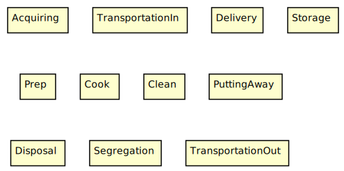

Haha! Welcome to Kitchen Flows!😍
The magical land of hope and wonders *(Charlie🦄)*! 

# Plantuml setup mac
Brace up charlie! 
VsCode:
- PlantUml
- Markdown Preview Enhanced (plantuml rendering in md)
- Vscode-reveal (for themes, quick export and rendering plantuml in md)

Monterey:
- Get Oracle java: remove old, reinstall new

      sudo rm -fr /Library/Internet\ Plug-Ins/JavaAppletPlugin.plugin
      sudo rm -fr /Library/PreferencePanes/JavaControlPanel.prefPane
      sudo rm -fr ~/Library/Application\ Support/Oracle/Java
      sudo rm -rf /Library/Java/JavaVirtualMachines

- Get Dot: brew upgrade; brew install graphviz

      brew install libtool
      brew link libtool
      brew install graphviz
      brew link --overwrite graphviz


# Kitchen

## Flows
Basic Kitchen Flows
 - Appearance
 - Expression
 - Dissolving

<div hidden> 

```
@startuml BasicFlows
state space
space : potential
state expression
expression : form
space -up-> expression : Appearance
expression --> space : Dissolution

		
@enduml
```
</div>


## Zones
The usual kitchen has a few zones:
 - Storage Zone (dry and refrigerated)
 - Prep Zone
 - Cook Zone
 - Clean-up Zone
 - Putting Away Zone
 - Disposal Zone
 - Segregation Zone

<div hidden> 

```
@startuml ZonesDiagram
rectangle Acquiring
rectangle TransportationIn
rectangle Delivery
rectangle Storage
rectangle Prep
rectangle Cook
rectangle Clean
rectangle PuttingAway
rectangle Disposal
rectangle Segregation
rectangle TransportationOut
@enduml
```
</div>



# Recipes

## Deployment diagram
<div hidden> 

```
@startuml Recipes1

'left to right direction
'top to bottom direction
scale 0.5
skinparam nodesep 5
skinparam ranksep 5
skinparam margin 1
skinparam padding 1
'skinparam linetype ortho

actor HungryCustomer
folder Produkty {
}
folder Utensils {
  card Garnek
  card Rondel
  card Patelnia
  card Tarka
  card Blender
}
folder Warzywa.Obróbka {
  folder Włoszczyzna {
    card Marchewka
    card Pietruszka
    card SelerKorzeń
    Marchewka     -[hidden]d- Pietruszka
    Pietruszka    -[hidden]d- SelerKorzeń
  }
  card Cebula
  SelerKorzeń -[hidden]d-> Cebula
}

frame Danie.Zupa {
 file Rosół
 file Pomidorowa
 file Barszcz
 file Ogórkowa
 Rosół      -[hidden]d- Pomidorowa
 Pomidorowa -[hidden]d- Barszcz
 Barszcz    -[hidden]d- Ogórkowa
}

Produkty -r- Utensils
Produkty -d- Warzywa.Obróbka
Utensils -d- Danie.Zupa

'Warzywa.Obróbka -right-> Danie.Zupa

Włoszczyzna   -r-> Rosół : 3x >
Włoszczyzna   -r-> Pomidorowa : 3x
Włoszczyzna   -r-> Barszcz : 3x
Włoszczyzna   -r-> Ogórkowa : 3x

Rosół -r-> HungryCustomer
Pomidorowa -r-> HungryCustomer
Barszcz -r-> HungryCustomer
Ogórkowa -r-> HungryCustomer
@enduml
```
</div>


## Class diagram
<div hidden> 

```
@startuml Recipes1

'left to right direction
'top to bottom direction
scale 0.5
skinparam nodesep 5
skinparam ranksep 5
skinparam margin 1
skinparam padding 1
skinparam linetype ortho

namespace Nagłówek {
  namespace Produkty {
    class Składniki
  }
  namespace Utensils {
    class Garnek
    class Rondel
    class Patelnia
    class Tarka
  }
  namespace Przepływy {
    class Gaz
    class Prąd
    class Woda
    class Ogień
  }
  namespace Inne1 {

  }
  Nagłówek.Produkty -r-> Nagłówek.Utensils
  Nagłówek.Utensils -r-> Nagłówek.Przepływy
  Nagłówek.Przepływy -r-> Nagłówek.Inne1
}

namespace Puszki #grey {
  class Groszek
  class Marchewkazgroszkiem
  class PomidoryKrojone
  class Passata
  class Przecier
  class Ananas
  class Tuńczyk
  class MakrelawPomidorach
}

namespace Warzywa.Obróbka #green {
  class Włoszczyzna 
    Włoszczyzna : Marchewka
    Włoszczyzna : Pietruszka
    Włoszczyzna : SelerKorzeń
    Włoszczyzna : Por
    Włoszczyzna : NatkaPietruszki
  
  class Cebula
  class Buraki
  class Pomidory
  class Kapusta
  class Brokuł
  class Kalafior
  class Dynia
  class DyniaPizmowa
}
namespace Warzywa.Kiszonki #navy {
  class OgórkiKiszone
  class KapustaKiszona
}

namespace Warzywa.Surowe #lightgreen {
  class Sałata
  class SałataLodowa
  class Pomidory
  class Cebula
  class Ogórki
}

namespace Tłuszcze #yellow {
 class Olej
 class Oliwa
 class Masło
 namespace Ziarna {
   class Słonecznika
   class SiemieLniane
 }
}

namespace Białko #lightblue {
 class Parówki
 class Frankfurerki
 class Kiełbasa
 class Wołowina
 class Wieprzowina
 class Kurczak
 class Ryby
 class Ciecierzyca
 class Soczewica
 class Fasola
}

namespace Nabiał {
  class Jajka
  class Ser
  class Twaróg
  class Śmietana
  class Mleko
}

namespace Owoce #pink {
  class Jabłka
  class Banany
  class Śliwki
  class Cytryny
  class Pomarańcze
  class Kokos
  namespace Suszone {
    class Rodzynki
    class Daktyle
  }
}
namespace Węglowodany #red {
 class Chleb
 class Ziemniaki
 class Makaron
 class KaszaOwsiana
 class KaszaJaglana
 class KaszaJęczmienna
 class KaszaGryczna
 class KaszaKuskus
 class Quinoa
}

namespace Mąki #orange {
  class Ryzowa
  class Pszenna
}

namespace Przyprawy #purple {
  namespace Żywe {
    class Czosnek
    class Imbir
  }
  namespace Marynaty {
    class Teryaki
    class OcetSpirytusowy
    class OcetWinny
    class OcetBalsamiczny
    class SokCytrynowy
  }
  class Sól
  class Pieprz
  class PaprykaSlodka
  class PaprykaChilli
  class Majeranek
  class Tymianek
  class Oregano
  class Bazylia
  class ZiołaProwansalskie
}


' Prod-Danie.Zupa =========================================
namespace Danie {

}
namespace Danie.Zupa {
  namespace Półprodukt {
    class Bulion
    class OgórkiSmazone
  }
 class Rosół
 class Pomidorowa
 class Barszcz
 class Ogórkowa
 class Krupnik
 class Jarzynowa
 class Dyniowa
 class Pieczarkowa
 class Rybna
 Rosół        -[hidden]d- Pomidorowa
 Pomidorowa   -[hidden]d- Barszcz
 Barszcz      -[hidden]d- Ogórkowa
 Ogórkowa     -[hidden]d- Krupnik
 Krupnik      -[hidden]d- Jarzynowa
 Jarzynowa    -[hidden]d- Dyniowa
 Dyniowa      -[hidden]d- Pieczarkowa
 Pieczarkowa  -[hidden]d- Rybna
}
' Danie.Zupa-Half-Prod =========================================
Warzywa.Obróbka.Włoszczyzna      -r-> Danie.Zupa.Półprodukt.Bulion : 1x >
Przyprawy.Sól                    -r-> Danie.Zupa.Półprodukt.Bulion
Warzywa.Kiszonki.OgórkiKiszone   -r-> Danie.Zupa.Półprodukt.OgórkiSmazone
Tłuszcze.Masło                   -r-> Danie.Zupa.Półprodukt.OgórkiSmazone

Nagłówek.Utensils.Garnek -[dotted]-> Danie.Zupa.Półprodukt.Bulion
Nagłówek.Utensils.Rondel -[dotted]-> Danie.Zupa.Półprodukt.OgórkiSmazone
Nagłówek.Przepływy.Ogień -[dotted]-> Danie.Zupa.Półprodukt.OgórkiSmazone

' Rosół
Danie.Zupa.Półprodukt.Bulion -r-> Danie.Zupa.Rosół
'Pomidorowa
Danie.Zupa.Półprodukt.Bulion -r-> Danie.Zupa.Pomidorowa
Puszki.Passata         -r-> Danie.Zupa.Pomidorowa
'Barszcz
Danie.Zupa.Półprodukt.Bulion -r-> Danie.Zupa.Barszcz
Warzywa.Obróbka.Buraki -r-> Danie.Zupa.Barszcz
'Ogórkowa
Danie.Zupa.Półprodukt.Bulion -r-> Danie.Zupa.Ogórkowa
Danie.Zupa.Półprodukt.OgórkiSmazone -r-> Danie.Zupa.Ogórkowa
'Pozostałe
Danie.Zupa.Półprodukt.Bulion -r-> Danie.Zupa.Krupnik
Węglowodany.KaszaJęczmienna -r-> Danie.Zupa.Krupnik
'Jarzynowa
Danie.Zupa.Półprodukt.Bulion -r-> Danie.Zupa.Jarzynowa
Węglowodany.Ziemniaki  -r-> Danie.Zupa.Jarzynowa
'Dyniowa
Danie.Zupa.Półprodukt.Bulion -r-> Danie.Zupa.Dyniowa
Warzywa.Obróbka.Dynia  -r-> Danie.Zupa.Dyniowa
Danie.Zupa.Półprodukt.Bulion -r-> Danie.Zupa.Pieczarkowa
Danie.Zupa.Półprodukt.Bulion -r-> Danie.Zupa.Rybna

' Prod-Danie.Śniadanie =========================================
namespace Danie.Śniadanie {
  class Owsianka5p
  class Angielskie
  class AmerykańskiePankejki
  class IndyjskiDal
  Owsianka5p           -[hidden]d- Angielskie
  Angielskie           -[hidden]d- AmerykańskiePankejki
  AmerykańskiePankejki -[hidden]d- IndyjskiDal
}

'Owianka5p
Węglowodany.KaszaOwsiana -r-> Danie.Śniadanie.Owsianka5p
Owoce.Jabłka             -r-> Danie.Śniadanie.Owsianka5p
Owoce.Banany             -r-> Danie.Śniadanie.Owsianka5p
Owoce.Suszone.Rodzynki   -r-> Danie.Śniadanie.Owsianka5p
Przyprawy.Sól            -r-> Danie.Śniadanie.Owsianka5p
Tłuszcze.Masło           -r-> Danie.Śniadanie.Owsianka5p
Tłuszcze.Ziarna.SiemieLniane -r-> Danie.Śniadanie.Owsianka5p

'Angielskie
Białko.Frankfurterki     -r-> Danie.Śniadanie.Angielskie
Węglowodany.Chleb        -r-> Danie.Śniadanie.Angielskie
Tłuszcze.Masło           -r-> Danie.Śniadanie.Angielskie
Warzywa.Surowe.Pomidory  -r-> Danie.Śniadanie.Angielskie


' Prod-Danie.DrugieDanie =========================================
namespace Danie.DrugieDanie {
      class Schabowy
}
Białko.Wieprzowina               -r-> Danie.DrugieDanie.Schabowy
Warzywa.Kiszonki.KapustaKiszona  -r-> Danie.DrugieDanie.Schabowy
Przyprawy.Sól                    -r-> Danie.DrugieDanie.Schabowy

'Danie.DrugieDanie
' Consumer =========================================
class Konsument
'Danie.Zupa
Danie.Zupa.Rosół -r-> Konsument
Danie.Zupa.Pomidorowa -r-> Konsument
Danie.Zupa.Barszcz -r-> Konsument
Danie.Zupa.Ogórkowa -r-> Konsument
Danie.Zupa.Krupnik -r-> Konsument
Danie.Zupa.Jarzynowa -r-> Konsument
Danie.Zupa.Dyniowa -r-> Konsument
Danie.Zupa.Pieczarkowa -r-> Konsument
Danie.Zupa.Rybna            -r-> Konsument
Danie.Śniadanie.Owsianka5p  -r-> Konsument
Danie.Śniadanie.Angielskie  -r-> Konsument
Danie.Śniadanie.AmerykańskiePankejki  -r-> Konsument
Danie.Śniadanie.IndyjskiDal  -r-> Konsument
Danie.DrugieDanie.Schabowy  -r-> Konsument

'
' Layout =========================================
Nagłówek.Produkty -[hidden]d- Warzywa.Obróbka
Nagłówek.Produkty -[hidden]d- Warzywa.Surowe
Nagłówek.Produkty -[hidden]d- Warzywa.Kiszonki
Nagłówek.Produkty -[hidden]d- Białko
Nagłówek.Produkty -[hidden]d- Owoce
Nagłówek.Produkty -[hidden]d- Węglowodany
Nagłówek.Produkty -[hidden]d- Mąki
Nagłówek.Produkty -[hidden]d- Tłuszcze
Nagłówek.Produkty -[hidden]d- Przyprawy

Puszki           -[hidden]d- Warzywa.Obróbka
Warzywa.Obróbka  -[hidden]d- Warzywa.Kiszonki
Warzywa.Kiszonki -[hidden]d- Warzywa.Surowe 
Warzywa.Surowe   -[hidden]d- Owoce
Owoce            -[hidden]d- Białko
Białko           -[hidden]d- Nabiał
Nabiał           -[hidden]d- Tłuszcze
Tłuszcze         -[hidden]d- Węglowodany
Węglowodany      -[hidden]d- Mąki
Mąki             -[hidden]d- Przyprawy

Danie.Zupa.Rybna       -[hidden]d- Danie.Śniadanie
Danie.Śniadanie        -[hidden]d- Danie.DrugieDanie


@enduml
```
</div>


